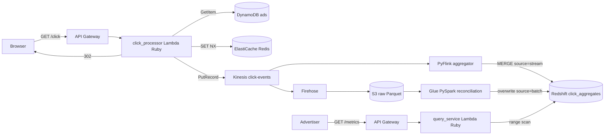

# Chapter 1: Basics and Architecture

This repo is an **educational** implementation of an ad click aggregator — the
system-design interview problem walked through in [REFERENCE.md](REFERENCE.md)
(Hello Interview / Evan). It is not a product; it exists so you can see the
streaming + batch analytics pattern wired up end to end on real AWS with
Terraform. This chapter gives you the four ideas you need in your head before
reading any code, a tour of where things live, and a trace of what physically
happens when one ad click hits the system.

## What the system actually does

Two user-facing jobs, and nothing else:

1. A user clicks an ad → they get **redirected** to the advertiser, and the click
   is **recorded**.
2. An advertiser asks "how many clicks did campaign X get, per minute, last
   Tuesday 2–3pm?" → they get an answer in **under a second**.

The hard part is the gap between those two. The numbers an advertiser sees drive
billing, so they must eventually be **exact**; but they also need to look
**fresh** (within a minute). Those two goals pull in opposite directions, and the
whole architecture is the resolution of that tension.

## Four concepts to hold in your head

**1. This is an "infrastructure design", not a CRUD app.** There are no REST
resources to model. The unit of thought is a *data pipeline*: events flow in one
end, get reshaped, and come out queryable at the other. When you read the code,
follow the *data*, not the objects.

**2. You cannot answer the query from raw clicks.** At 10k clicks/sec, a week of
data is billions of rows. Scanning them per query blows the <1s budget. So the
system **pre-aggregates**: it collapses raw clicks into per-campaign,
per-minute counts ahead of time, and queries read those small rollups. This is
the single most important design move in the whole repo.

**3. Two write paths, one read surface.** Pre-aggregation happens twice:
- A **stream** path (Flink) updates minute counts in near-real-time — fast but
  approximate (it can drop late data, double-count on restart).
- A **batch** path (Spark) recomputes the same minutes from an immutable raw
  archive — slow but exact, and it *overwrites* the stream's numbers.

Both write the same Redshift table, tagged with a `source` column (`'stream'` vs
`'batch'`). The reference calls this "periodic reconciliation"; it's neither pure
Kappa (stream-only) nor pure Lambda (two separate serving layers).

**4. Idempotency and hot shards are first-class.** A click must count *at most
once* even if the browser retries (dedup by impression ID in Redis), and one
viral ad must not melt a single Kinesis shard (a salted partition key spreads it).

## The pipeline, end to end



Caption: notice that **Kinesis fans out to two consumers** (Flink for speed,
Firehose→S3 for durability/replay), and both Flink and Glue write the *same*
`click_aggregates` table.

Each box maps to a directory you can open. The reference design names every one of
these components, and [the constitution](.specify/memory/constitution.md) makes
implementing them faithfully a hard rule ("Reference-Architecture Fidelity").

## Repo layout

```text
services/          Ruby 3.3 Lambdas + a shared gem
  shared/            entities + AWS wrappers (TimeBucket, ClickEvent, Aws::*)
  click_processor/   GET /click: validate, dedup, emit, redirect   (Chapter 2)
  query_service/     GET /metrics: ownership, query, zero-fill      (Chapter 4)
stream/
  flink-aggregator/  PyFlink: Kinesis -> 1-min window -> Redshift    (Chapter 3)
batch/
  reconciliation/    PySpark Glue job: S3 -> exact counts -> Redshift (Chapter 5)
infra/terraform/   modules: storage, ingestion, streaming, query, reconciliation
                   + envs/dev (the root that wires them)             (Chapter 7)
seeds/             sample catalog + a click traffic simulator
specs/             the Spec Kit spec, plan, research decisions, contracts
docs/              architecture + validation runbooks
```

Two languages, on purpose: **Ruby** for the service tier (the maintainer's
preference) and **Python** for the two engines that have no Ruby runtime (PyFlink,
PySpark). There is deliberately no Java — see [Chapter 3](03-stream-aggregation-pyflink.md)
for why the Flink job was migrated to PyFlink.

## A click's life, in order

When you `GET /click?ad_id=ad_demo_1&impression_id=imp_001`:

1. **API Gateway** invokes the click-processor Lambda
   ([services/click_processor/lib/handler.rb](services/click_processor/lib/handler.rb)).
2. The handler looks the ad up in **DynamoDB**; unknown/inactive → `404`, no count.
3. It runs `SET imp:<id> 1 NX` in **Redis**; if the key already existed, the click
   is a duplicate → redirect but emit nothing.
4. First time? It builds a `ClickEvent` and `PutRecord`s it to **Kinesis** with
   partition key `ad_id:<salt>`.
5. It returns `302 Location: <advertiser url>`. The user leaves *after* the click
   is durably enqueued — logging never loses to the redirect.
6. Asynchronously: **Flink** counts the click into the current minute window and
   `MERGE`s it into Redshift; **Firehose** lands the raw JSON in S3 as Parquet.
7. Later: the advertiser's `GET /metrics` reads the Redshift rollups; an hourly
   **Glue** job re-derives the exact counts from S3 and overwrites that minute.

Everything after this chapter is just zooming into one of those steps.

## A note on running things

The project pins specific toolchains; the first time a later chapter shows a
command it will call out the quirk. The big ones, up front:

- Ruby Lambdas are **Ruby 3.3** in production but the repo tests fine on **Ruby
  3.2+**. Use `bundle exec rspec`, never a bare `rspec`.
- The PyFlink test needs **Python 3.11** (apache-flink doesn't support 3.12+);
  the PySpark test needs **Python ≤3.12**.
- Terraform commands run from the repo root via `terraform -chdir=infra/terraform/envs/dev …`.
- AWS credentials come from your environment (the provider uses the default chain);
  nothing is hardcoded.

## Try it out

Try each step yourself first — expand the solution only when stuck.

1. Without grepping, predict which directory contains the code that decides whether
   a click is a duplicate. Then verify.

   <details>
   <summary><b>Solution</b></summary>

   Dedup is idempotency (concept 4), which lives on the click-capture path.

   ```bash
   ls services/click_processor/lib
   # ad_repository.rb  deduper.rb  handler.rb
   ```
   `deduper.rb` wraps the Redis `SET NX`. The concept ("count at most once per
   impression") is implemented exactly where the data first arrives.
   </details>

2. Find every place the string `click_aggregates` appears and explain why it shows
   up in both `stream/` and `batch/`.

   <details>
   <summary><b>Solution</b></summary>

   ```bash
   grep -rl "click_aggregates" stream batch specs/001-ad-click-aggregator/contracts
   ```
   It appears in [stream/flink-aggregator/main.py](stream/flink-aggregator/main.py)
   and [batch/reconciliation/job.py](batch/reconciliation/job.py) because both the
   stream and batch paths write the same Redshift table (concept 3). The `source`
   column is how a reader tells which path produced a given row.
   </details>

3. Open [REFERENCE.md](REFERENCE.md) and match its "Hot shard problem" section to a
   line of code in this repo.

   <details>
   <summary><b>Solution</b></summary>

   ```bash
   grep -n "salt" services/shared/lib/shared/aws/kinesis.rb
   ```
   `partition_key` returns `"#{ad_id}:#{SecureRandom.random_number(@salt_factor)}"`.
   That salt is the mitigation the reference describes — a viral ad fans across up
   to `salt_factor` shards instead of pinning one.
   </details>

4. Read the four non-negotiable principles' names in the constitution and decide
   which one forbids you from "just adding a quick DynamoDB table by hand in the
   console."

   <details>
   <summary><b>Solution</b></summary>

   ```bash
   grep -n "^### " .specify/memory/constitution.md
   ```
   Principle II, *Infrastructure as Code (Terraform)*: every AWS resource must be in
   committed Terraform; console mutations are prohibited. That is why Chapter 7 is
   entirely Terraform.
   </details>

Next: [Chapter 2](02-click-capture-path.md) follows a single click through the
Ruby click processor — the one synchronous, user-blocking path in the system, and
the place idempotency and the redirect trade-off actually live.
