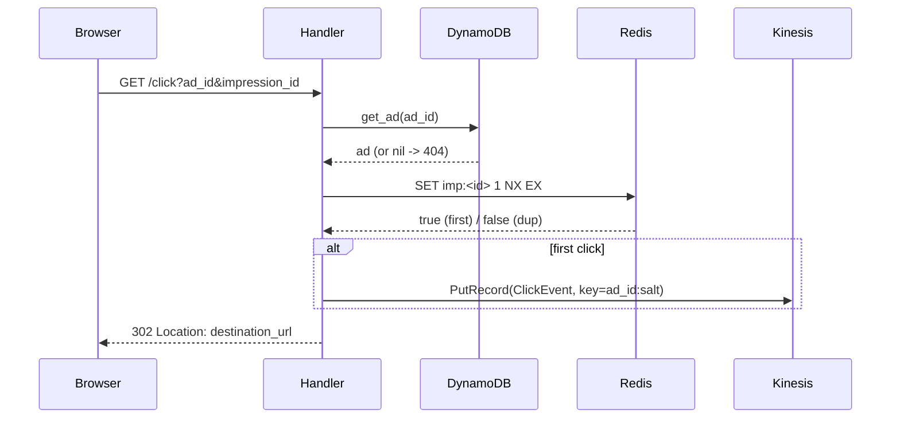

# Chapter 2: The Click Capture Path

This is the only synchronous, user-blocking path in the system: a browser hits
`GET /click`, and a human is waiting for the redirect. Everything has to happen in
a few milliseconds, and the click must be captured *before* the user leaves. We'll
walk the Ruby click processor top to bottom —
[services/click_processor/lib/handler.rb](services/click_processor/lib/handler.rb)
— and the shared primitives it leans on.

## The handler is a pipeline of guards

`ClickProcessor::Handler#call` reads like a checklist, and the order is the design:

```ruby
def call(event)
  params = event["queryStringParameters"] || {}
  ad_id = presence(params["ad_id"])
  impression_id = presence(params["impression_id"])
  click_ts = presence(params["click_ts"])

  return error(400, "missing_parameter", "...") unless ad_id && impression_id

  ad = @ad_repository.active_ad(ad_id)
  return error(404, "unknown_ad", "...") if ad.nil?

  if @deduper.first_click?(impression_id)
    emit_click(ad, impression_id, click_ts)
  end

  redirect(ad.destination_url)
rescue => e
  # Enqueue or downstream failure: surface as 502 so the edge/client retries.
  error(502, "enqueue_failed", e.message)
end
```

Read it as four decisions: *is the request well-formed?* → *is the ad real?* →
*is this the first time we've seen this impression?* → *redirect.* Notice what is
**not** here: no try/rescue swallowing a failed Kinesis put. If `emit_click`
raises, the whole method falls into the `rescue` and returns **502**, so the edge
or client retries. That is the constitution's Principle IV ("no silent failures")
expressed in nine lines — a dropped click is a billing error, so we'd rather 502
than pretend success.



Caption: the redirect is the *last* thing that happens — and only after the put to
Kinesis succeeds. The user never leaves before the click is durable.

## Redirect: log first, then leave

The reference describes two ways to handle click→redirect. This repo picked the
"better" one and the contract documents why
([specs/001-ad-click-aggregator/contracts/click-api.yaml](specs/001-ad-click-aggregator/contracts/click-api.yaml)):

| Approach | What happens | Why rejected / chosen |
|----------|-------------|------------------------|
| Redirect immediately, beacon the click in parallel | Lower latency | An ad-blocker can drop the beacon → lost click. **Rejected.** |
| Server-side: log through the processor, then 302 | One extra hop | Click is durable before the user leaves. **Chosen.** |

The cost is one synchronous Redis call + one Kinesis put on the hot path. Both are
single-digit ms, which the project accepts for an educational build.

## Idempotency: `SET NX` is the whole trick

Dedup is one Redis call in
[services/shared/lib/shared/aws/redis.rb](services/shared/lib/shared/aws/redis.rb):

```ruby
def first_click?(impression_id)
  result = @client.set("#{KEY_PREFIX}#{impression_id}", "1", nx: true, ex: @ttl)
  result == true || result == "OK"
end
```

`NX` means "set only if absent." It is **atomic**, which is the entire reason this
works under concurrency. Two duplicate clicks for the same impression can race into
the Lambda simultaneously; Redis serializes them, so exactly one gets `true`.

Here is the same impression arriving three times (a browser retry storm). The
`ex` (TTL) is 48h, longer than a reconciliation cycle so the stream and batch paths
agree on what "already seen" means:

| Call | Redis state before | `SET … NX` returns | `first_click?` | emit to Kinesis? |
|------|--------------------|--------------------|----------------|------------------|
| 1st  | (empty)            | `true`             | `true`         | yes              |
| 2nd  | `imp:imp_001=1`    | `false`            | `false`        | no               |
| 3rd  | `imp:imp_001=1`    | `false`            | `false`        | no               |

Three HTTP requests, three `302`s (the user always gets redirected), **one** click
counted. That is success criterion SC-005. The redirect is intentionally outside
the `if first_click?` block — duplicates still need to reach the advertiser.

## Building the event: minute buckets are computed once

When it *is* a first click, `emit_click` builds a `ClickEvent`
([services/shared/lib/shared/click_event.rb](services/shared/lib/shared/click_event.rb)):

```ruby
def self.build(impression_id:, ad_id:, campaign_id:, advertiser_id:,
  click_ts: nil, user_agent: nil, now: nil)
  ts = Shared::TimeBucket.coerce(click_ts).utc
  new(
    event_id: SecureRandom.uuid,
    ...
    click_ts: ts.iso8601,
    minute_bucket: Shared::TimeBucket.minute_floor(ts),
    ...
  )
end
```

The `minute_bucket` (e.g. `"2026-06-13T14:07:00Z"`) is derived from `click_ts`
*here, at capture*, and travels with the event. That matters: the same floor is
used by Flink (stream) and Spark (batch), so both paths agree which minute a click
belongs to even if it arrives late. `minute_floor` is deliberately boring
([services/shared/lib/shared/time_bucket.rb](services/shared/lib/shared/time_bucket.rb)):
it forces UTC and zeroes the seconds, and `valid_bucket?` enforces the
`YYYY-MM-DDTHH:MM:00Z` shape so a malformed bucket can't silently slip downstream.

The event also carries a denormalized `campaign_id` and `advertiser_id`. That's a
deliberate redundancy: it lets Flink and Spark aggregate by campaign **without a
join back to DynamoDB**.

## Hot shards: a salted partition key

`emit_click` calls `@kinesis.put_click`
([services/shared/lib/shared/aws/kinesis.rb](services/shared/lib/shared/aws/kinesis.rb)):

```ruby
def put_click(click_event)
  resp = @client.put_record(
    stream_name: @stream,
    partition_key: partition_key(click_event.ad_id),
    data: click_event.to_json
  )
  resp.sequence_number
end

def partition_key(ad_id)
  "#{ad_id}:#{SecureRandom.random_number(@salt_factor)}"
end
```

Kinesis routes records to shards by hashing the partition key. If the key were just
`ad_id`, a viral ad ("Nike + LeBron") would hash to one shard and overwhelm it. The
salt — a random integer in `[0, salt_factor)` — turns one hot key into up to
`salt_factor` keys, spreading the load. Correctness is unaffected because Flink
re-aggregates by `campaign_id` downstream; the salt only exists to balance writes.

| Partition key | Distinct shards a single ad can hit | Hot-ad risk |
|---------------|-------------------------------------|-------------|
| `ad_id`       | 1                                   | one shard melts |
| `ad_id:salt` (factor 8) | up to 8                   | load spread 8x |

## Why this is all dependency-injected

`Handler.new(ad_repository:, deduper:, kinesis:)` takes its collaborators as
arguments; `ClickProcessor.build_from_env` is the only place that constructs real
AWS clients, and it's skipped when `ENV["SKIP_HANDLER_BOOT"]` is set. That single
flag is what lets the test suite ([Chapter 6](06-testing.md)) exercise the handler
with fakes and never touch AWS. We'll lean on it heavily there.

## Try it out

Try each step yourself first — expand the solution only when stuck.

Setup (first time): the handler file boots AWS clients at require-time unless told
not to, so tests set `SKIP_HANDLER_BOOT`. The suite is already wired for it.

```bash
cd services/click_processor && bundle install
```

1. Run only the click-processor unit specs and confirm the idempotency test passes.

   <details>
   <summary><b>Solution</b></summary>

   In zsh, quote the tag or the `~` is treated as a home-dir glob:
   ```bash
   cd services/click_processor
   bundle exec rspec '--tag' '~integration'
   ```
   Look for `7 examples, 0 failures`. The relevant example is "redirects but emits
   nothing for a duplicate impression (SC-005)".
   </details>

2. Make the handler reject a non-`https` destination (open-redirect guard). Add the
   check and a test.

   <details>
   <summary><b>Solution</b></summary>

   In [services/click_processor/lib/handler.rb](services/click_processor/lib/handler.rb),
   after the `ad.nil?` guard:
   ```ruby
   return error(404, "unknown_ad", "...") if ad.nil?
   unless ad.destination_url.to_s.start_with?("https://")
     return error(404, "unknown_ad", "ad #{ad_id} has no valid destination")
   end
   ```
   Add to `spec/handler_spec.rb` an ad with `destination_url: "http://evil"` and
   assert `resp[:statusCode]` is `404`. Run `bundle exec rspec '--tag' '~integration'`.
   The data-model already states destinations must be absolute `https` URLs.
   </details>

3. Change the salt factor to 1 and prove (by reading the spec) that dedup still
   works but hot-shard protection is gone.

   <details>
   <summary><b>Solution</b></summary>

   ```bash
   cd services/shared
   bundle exec rspec spec/aws/kinesis_spec.rb
   ```
   The spec "treats a salt_factor below 1 as 1" asserts `partition_key("ad_1")`
   becomes `"ad_1:0"` — a single bucket. Dedup (Redis) is independent of the salt,
   so SC-005 is unaffected; only SC-006 (hot-shard spread) degrades.
   </details>

4. Trace what HTTP status a `PutRecord` failure produces, then write a test that
   forces it.

   <details>
   <summary><b>Solution</b></summary>

   The `rescue => e` in `call` maps any downstream raise to `502`. A test:
   ```ruby
   allow(kinesis).to receive(:put_click).and_raise(StandardError.new("throttled"))
   resp = handler.call(event("ad_id" => "ad_1", "impression_id" => "imp_1"))
   expect(resp[:statusCode]).to eq(502)
   ```
   This exact case already exists in `spec/handler_spec.rb` ("returns 502 … no
   silent drop"). It encodes Principle IV: a lost click must fail loudly.
   </details>

Next: [Chapter 3](03-stream-aggregation-pyflink.md) picks up where the Kinesis put
leaves off — how PyFlink turns that stream of individual clicks into per-minute
counts, and why event-time windows are the subtle part.
