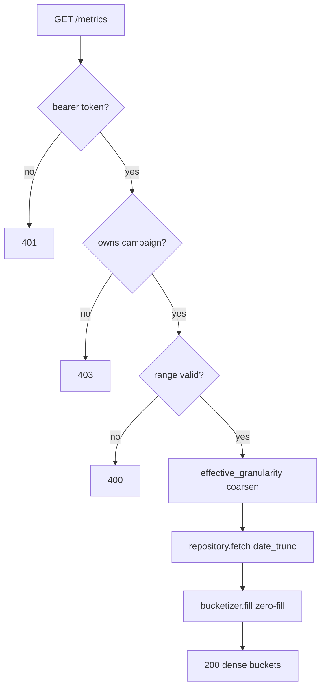

# Chapter 4: The Query Service

Flink has been quietly filling a Redshift table with `(campaign_id, minute_bucket,
click_count)` rows. Now an advertiser opens a dashboard and asks for "campaign
camp_demo, last Tuesday, per hour." The query service —
[services/query_service/lib/handler.rb](services/query_service/lib/handler.rb) —
turns that request into a fast, *scoped*, *dense* answer. The interesting code here
isn't the SQL; it's the `Bucketizer`, which solves two non-obvious problems:
empty-minute gaps and absurdly large time ranges.

## The handler: four steps, ownership first

```ruby
def call(event)
  params = event["queryStringParameters"] || {}
  advertiser_id = principal_advertiser_id(event)
  return error(401, "unauthenticated", "missing bearer token") unless advertiser_id

  campaign_id = presence(params["campaign_id"])
  granularity = presence(params["granularity"]) || "minute"
  return error(400, "missing_parameter", "...") unless campaign_id
  return error(400, "bad_granularity", "...") unless VALID_GRANULARITY.include?(granularity)

  from, to = parse_range(params)
  return error(400, "bad_range", "...") unless from && to && to > from

  unless @ownership.owns?(advertiser_id: advertiser_id, campaign_id: campaign_id)
    return error(403, "forbidden", "campaign not owned by caller")
  end

  bucketizer = Bucketizer.new(from: from, to: to, granularity: granularity)
  effective = bucketizer.effective_granularity
  rows = @repository.fetch(campaign_id:, from:, to:, granularity: effective)
  result = bucketizer.fill(rows, granularity: effective)
  ok(campaign_id:, from:, to:, result:)
end
```

The order is a security decision. `advertiser_id` comes from
`principal_advertiser_id` — the bearer token — **never** from the query string. An
attacker can't pass `?advertiser_id=someone_else`; the value is ignored. Then
`@ownership.owns?` (a DynamoDB GSI lookup in
[services/query_service/lib/ownership.rb](services/query_service/lib/ownership.rb))
gates the query: you can only read campaigns you own (FR-009). The 403 happens
*before* any Redshift query runs.

> The bearer token *is* the advertiser id in this educational build — a documented
> shortcut. A real deployment would validate a JWT and read an `advertiser_id`
> claim; the handler wouldn't change.

## The repository: roll up at query time

[services/query_service/lib/aggregate_repository.rb](services/query_service/lib/aggregate_repository.rb)
is thin on purpose:

```ruby
sql = <<~SQL
  SELECT date_trunc('#{unit}', minute_bucket) AS bucket_start,
         SUM(click_count)                      AS click_count,
         MIN(source)                           AS source
    FROM click_aggregates
   WHERE campaign_id = $1 AND minute_bucket >= $2 AND minute_bucket < $3
   GROUP BY 1 ORDER BY 1
SQL
```

Redshift only ever stores **minute** rows (that's all Flink and Spark write). Hour
and day views are computed on the fly with `date_trunc`. That's a deliberate
trade-off: no redundant pre-rolled hour/day tables to keep in sync (YAGNI), at the
cost of a `GROUP BY` per query — cheap, because the aggregate table is tiny and
sorted on `(campaign_id, minute_bucket)`.

Two subtleties:
- `unit` is interpolated into the SQL string, not bound as a parameter. That's safe
  *because* it's allow-listed against `GRANULARITY_UNIT` first — Redshift's
  `date_trunc` requires a literal unit, not a bind variable. Everything else
  (`$1..$3`) is parameterized.
- `MIN(source)` exploits string ordering: `'batch' < 'stream'`, so a rolled-up
  bucket reports `'batch'` only if it's *entirely* reconciled. The `Bucketizer`
  recomputes this more precisely when it re-rolls (below).

## The Bucketizer problem 1: holes

Redshift returns only minutes that *had* clicks. But a dashboard needs a continuous
series — a minute with zero clicks must show `0`, not vanish (FR-010). `fill`
([services/query_service/lib/bucketizer.rb](services/query_service/lib/bucketizer.rb#L32))
walks every bucket in `[from, to)` and looks each up:

```ruby
cursor = floor(@from, gran)
while cursor < @to
  hit = counts[cursor.utc.to_i]
  buckets << {
    bucket_start: cursor.utc.iso8601,
    click_count: hit ? hit[:count] : 0,
    source: hit ? hit[:source] : "stream"
  }
  cursor += step
end
```

Concrete run — query `14:00 → 14:03` at minute granularity, Redshift returned only
two rows:

```
Redshift rows:   {14:00 -> 5, batch}   {14:02 -> 3, stream}
                         |                       |
fill walks every minute in [14:00, 14:03):
  14:00  -> hit   -> {count: 5, source: batch}
  14:01  -> miss  -> {count: 0, source: stream}   <- zero-filled
  14:02  -> hit   -> {count: 3, source: stream}
result: [5, 0, 3]   (3 dense buckets, not 2)
```

That `[5, 0, 3]` is exactly what
`services/query_service/spec/bucketizer_spec.rb` asserts.

## The Bucketizer problem 2: ranges too big to bucket

Ask for a *year* at minute granularity and you'd try to build ~525,600 buckets —
slow, and useless on a dashboard. The original spec said "return 400." During
review (finding **I1**) that was changed: instead of erroring, the bucketizer
**auto-coarsens** until the series fits under `MAX_BUCKETS = 1500`:

```ruby
def effective_granularity(requested = @requested)
  idx = ORDER.index(requested) or raise ArgumentError, "bad granularity"
  while idx < ORDER.size - 1 && bucket_count(ORDER[idx]) > MAX_BUCKETS
    idx += 1
  end
  ORDER[idx]
end
```

`ORDER` is `["minute", "hour", "day"]`. Walk a 90-day query:

| granularity | bucket_count over 90 days | > 1500? | action |
|-------------|---------------------------|---------|--------|
| minute      | ~129,600                  | yes     | coarsen → hour |
| hour        | 2,160                     | yes     | coarsen → day  |
| day         | 90                        | no      | **stop, use day** |

So a 90-day minute request silently returns **day** buckets, and the response
reports `granularity: "day"` so the client knows. The handler queries Redshift at
the *effective* granularity (`@repository.fetch(..., granularity: effective)`), so
the `date_trunc` and the fill agree. Contrast a 1-hour request: minute fits
(60 < 1500), so it stays minute. This is "degrade, don't fail" — the spec's edge
case wanted results "at an appropriate granularity without timing out."

## Rolling up source correctly

When the bucketizer coarsens, it re-aggregates minute rows into the bigger bucket
in `index_rows`, and recomputes `source` honestly:

```ruby
entry[:all_batch] &&= (r[:source] == "batch")
...
{count: e[:count], source: e[:all_batch] ? "batch" : "stream"}
```

An hour is `'batch'` (exact) only if *every* contributing minute was reconciled;
one stream-only minute taints it to `'stream'` (approximate). That's a more precise
rule than the repository's `MIN(source)`, which is why the logic lives here for the
rolled-up case.



Caption: every guard (`401/403/400`) short-circuits before Redshift is touched —
auth and validation are cheap; queries are not.

## Try it out

Try each step yourself first — expand the solution only when stuck.

```bash
cd services/query_service && bundle install
```
(`pg` compiles a native extension; you need libpq, which ships with most Postgres
client installs.)

1. Run the query specs and find the test that proves the bearer token can't be
   spoofed by a query-string `advertiser_id`.

   <details>
   <summary><b>Solution</b></summary>

   ```bash
   cd services/query_service && bundle exec rspec '--tag' '~integration'
   ```
   `12 examples`. The example "derives advertiser_id from the bearer token, not the
   query string" passes a `?advertiser_id=spoofed` and asserts the captured id is
   `adv_real` (the token).
   </details>

2. Lower `MAX_BUCKETS` to 50 and predict what granularity a 2-hour minute query
   coarsens to.

   <details>
   <summary><b>Solution</b></summary>

   In `lib/bucketizer.rb` set `MAX_BUCKETS = 50`. A 2-hour minute query = 120
   buckets > 50 → coarsen to hour (2 buckets ≤ 50). Add/adjust a spec asserting
   `Bucketizer.new(from:, to:, granularity: "minute").effective_granularity == "hour"`.
   Run the specs. This shows the cap, not the wall-clock, drives coarsening.
   </details>

3. Add `week` as a granularity. What two places must change?

   <details>
   <summary><b>Solution</b></summary>

   `VALID_GRANULARITY` in `handler.rb`, and `ORDER`/`STEP`/`GRANULARITY_UNIT` in
   `bucketizer.rb` + `aggregate_repository.rb`. Redshift's `date_trunc('week', …)`
   works, so the repository needs the unit allow-listed. Without the allow-list
   entry, `fetch` raises `unsupported granularity` — proving the interpolation guard
   from earlier actually does its job.
   </details>

4. Force a `MIN(source)` vs bucketizer-`source` disagreement and explain which is
   right.

   <details>
   <summary><b>Solution</b></summary>

   Feed `fill` an hour with one `batch` minute and one `stream` minute (see the hour
   rollup test in `bucketizer_spec.rb`). The bucketizer reports `'stream'`
   (`all_batch` is false). That's the correct answer: the hour isn't fully exact.
   `MIN(source)` would also say `'stream'` here, but only the bucketizer stays
   correct once minutes are re-rolled client-side.
   </details>

Next: [Chapter 5](05-reconciliation.md) is the batch counterweight — the PySpark
job that recomputes those same minutes from the raw S3 archive and stamps them
`'batch'`, turning the approximate stream numbers into billing-grade exact ones.
