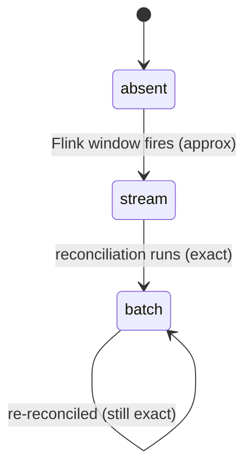

# Chapter 5: Reconciliation with PySpark

The stream path is fast but lies a little: it drops clicks later than its watermark
and can double-count on restart. For *fresh dashboards* that's fine. For *billing*
it isn't. Reconciliation is the fix: an hourly batch job that recomputes each minute
from the immutable raw archive and overwrites the stream's numbers with exact ones.
This is [batch/reconciliation/job.py](batch/reconciliation/job.py), a PySpark job on
AWS Glue.

## Where the raw data comes from

Recall from [Chapter 1](01-basics-and-architecture.md) that Kinesis fans out to two
consumers. The second is Kinesis Data Firehose, configured in
[infra/terraform/modules/streaming/firehose.tf](infra/terraform/modules/streaming/firehose.tf),
which dumps every raw click to S3 as Parquet, partitioned by date and hour:

```
s3://…-raw-clicks/raw/dt=2026-06-13/hr=14/*.parquet
```

This archive is the **source of truth**. The stream path is a cache of it. Anything
the stream got wrong, the archive can correct, because it has *every* click — late
ones included.

## The Lambda/Kappa idea, concretely

The reference frames this precisely. Two classic architectures:

| Architecture | Idea | Downside |
|--------------|------|----------|
| **Kappa** | Everything through the stream; reprocess by replaying the stream | A bug means replaying the entire stream |
| **Lambda** | A batch layer *and* a separate real-time layer serve queries side by side | Two serving systems to keep consistent |
| **This repo** | One serving table; stream writes it fast, batch *overwrites the same rows* exactly | — |

The repo's twist is that batch and stream write the **same** `click_aggregates`
table, distinguished by the `source` column. There's no second serving system. A
minute's lifecycle is a tiny state machine:



Caption: once a minute is `batch`, it's authoritative; the query service's
`source` column tells you which minutes are still approximate.

## The pure core: `recompute`

The single most important design choice in this file is that the transform is a
**pure function** of a DataFrame — no AWS, no I/O — so it's unit-testable:

```python
def recompute(raw: DataFrame) -> DataFrame:
    dedup_order = Window.partitionBy("impression_id").orderBy(F.col("ingest_ts").asc())
    deduped = (
        raw.withColumn("_rn", F.row_number().over(dedup_order))
        .filter(F.col("_rn") == 1)
        .drop("_rn")
    )
    return (
        deduped.groupBy("campaign_id", "minute_bucket")
        .agg(F.count(F.lit(1)).alias("click_count"))
        .select("campaign_id", "minute_bucket", "click_count")
    )
```

Two steps. First, **dedup by `impression_id`** — even though Redis already
de-duplicated at capture, the archive might contain duplicates (a Redis TTL
expiry, a retried Firehose batch). Belt and suspenders: exactness can't depend on
the cache. `row_number()` over a window partitioned by `impression_id`, ordered by
`ingest_ts`, keeps exactly one row per impression *deterministically* (earliest
ingest wins — so re-runs produce identical output). Second, **count per (campaign,
minute)**.

Walk the same retry storm from [Chapter 2](02-click-capture-path.md), now in the
archive:

| impression_id | campaign | minute_bucket | ingest_ts | row_number | kept? |
|---------------|----------|---------------|-----------|-----------|-------|
| imp_1 | c1 | 14:07 | …:07:01 | 1 | yes |
| imp_1 | c1 | 14:07 | …:07:02 | 2 | no |
| imp_1 | c1 | 14:07 | …:07:03 | 3 | no |

→ `recompute` emits `(c1, 14:07, 1)`. Three raw rows, one counted — the same SC-005
guarantee the stream made, re-derived from cold storage. This is the test
`test_dedups_by_impression_id` in
[batch/reconciliation/tests/test_recompute.py](batch/reconciliation/tests/test_recompute.py).

## Late events just work

There's no watermark here. `recompute` reads a *closed* hour from S3 and counts
whatever it finds, by `minute_bucket`. A click that arrived 5 minutes late — dropped
by Flink — is sitting in the archive with its original `14:07` bucket, and the batch
count picks it up. That's `test_late_event_lands_in_its_own_minute`. Batch trades
latency for completeness; that's the whole point of having both paths.

## The swap: stage, then overwrite atomically

Computing exact counts is half the job; *replacing* the stream's numbers without a
window where the table is wrong is the other half. `_swap_into_redshift` does it in
two moves:

```python
# 1. land exact counts in a staging table
counts.write.format("jdbc").option("dbtable", "click_aggregates_stage") \
      .mode("overwrite").option("truncate", "true").save()

# 2. atomic period swap via the Redshift Data API
swap_sql = f"""
  BEGIN;
    DELETE FROM click_aggregates
     WHERE minute_bucket >= '{period_start}' AND minute_bucket < '{period_end}';
    INSERT INTO click_aggregates (campaign_id, minute_bucket, click_count, source, updated_at)
    SELECT campaign_id, minute_bucket, click_count, 'batch', GETDATE()
      FROM click_aggregates_stage;
    TRUNCATE click_aggregates_stage;
  COMMIT;
"""
```

Inside one transaction: delete the period's rows (stream *and* any prior batch),
insert the freshly recomputed rows tagged `'batch'`, clear staging. Because it's
`BEGIN…COMMIT`, a concurrent `GET /metrics` sees either all old rows or all new
rows — never a half-deleted period. Reprocessing the *whole* closed period (not
just deltas) is what makes the job **idempotent**: run it twice, same result.

```mermaid
sequenceDiagram
  participant EB as EventBridge (hourly)
  participant GL as Glue job.py
  participant S3 as S3 raw/dt=/hr=
  participant RS as Redshift
  EB->>GL: start (period = previous hour)
  GL->>S3: read Parquet for [start, end)
  GL->>GL: recompute() dedup + count
  GL->>RS: load click_aggregates_stage
  GL->>RS: BEGIN; DELETE period; INSERT 'batch'; COMMIT
```

Caption: the `DELETE`+`INSERT` is one transaction, so queries never observe a
partially reconciled hour.

## When it runs

[infra/terraform/modules/reconciliation/glue.tf](infra/terraform/modules/reconciliation/glue.tf)
schedules the job hourly with EventBridge, passing the previous closed hour as
`period_start`. Hourly is a tunable (`reconciliation_schedule`): more often = fresher
exact numbers, more cost. The reference allows hourly or daily; this repo picked
hourly as the middle.

## Try it out

Try each step yourself first — expand the solution only when stuck.

Setup: the pure-function tests run on local Spark and need **Python ≤3.12** (PySpark
3.3 doesn't support newer). Use a matching interpreter.

```bash
cd batch/reconciliation
python3.11 -m venv .venv && . .venv/bin/activate
pip install -r requirements-dev.txt
```

1. Run the reconciliation tests and confirm dedup collapses a triple-fire to one.

   <details>
   <summary><b>Solution</b></summary>

   ```bash
   cd batch/reconciliation && python -m pytest -q
   ```
   Look for `test_dedups_by_impression_id` passing — it asserts the `(c1, 14:07)`
   count is `1` despite three identical rows.
   </details>

2. Break determinism: change the dedup order to `desc()` and explain why the count
   is unchanged but the *kept row* differs.

   <details>
   <summary><b>Solution</b></summary>

   In `job.py`, `orderBy(F.col("ingest_ts").desc())` keeps the latest ingest instead
   of earliest. The *count* is still 1 (still one row per impression), but which
   physical row survives flips. Determinism matters for reproducible re-runs, not for
   the count — tests still pass. Revert it afterward.
   </details>

3. Add a test proving an out-of-order/late click is counted (no watermark to drop
   it).

   <details>
   <summary><b>Solution</b></summary>

   It already exists: `test_late_event_lands_in_its_own_minute` feeds a row whose
   `ingest_ts` is two minutes after its `minute_bucket` and asserts the 14:07 count
   includes it. Compare with Chapter 3's watermark, which *would* drop it from the
   stream path — that's the gap reconciliation closes.
   </details>

4. Explain why the swap uses `DELETE`+`INSERT` over the whole period instead of an
   `UPDATE` of changed rows.

   <details>
   <summary><b>Solution</b></summary>

   A row present in the stream but absent from the recomputed set (e.g. a
   double-counted phantom minute) must *disappear*. `UPDATE` can't delete rows;
   wiping the period and reinserting the authoritative set handles additions,
   corrections, and removals uniformly — and stays idempotent. See the swap SQL
   mirrored in `specs/001-ad-click-aggregator/contracts/redshift-schema.sql`.
   </details>

Next: [Chapter 6](06-testing.md) steps back to ask *how* all this stays verifiable —
the dependency-injection seams, the LocalStack and MiniCluster harnesses, and the
deliberate decision about what is and isn't tested.
