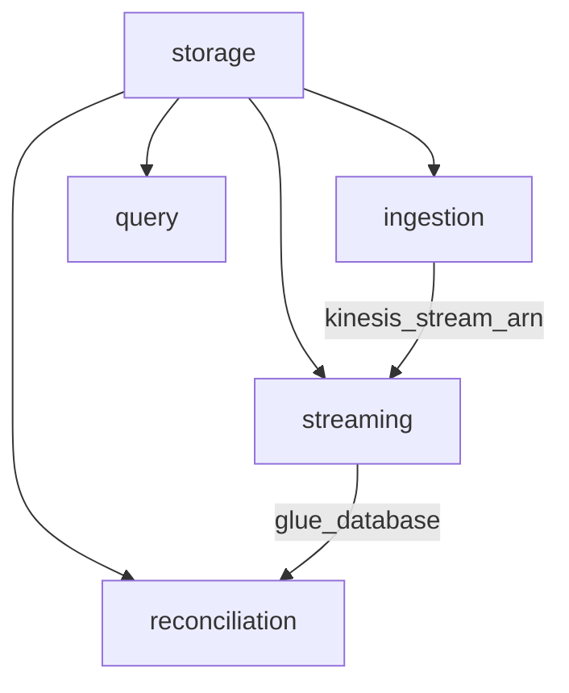

# Chapter 7: Deployment and Infrastructure

Every prior chapter was code. This one is how that code becomes running AWS
infrastructure — entirely through Terraform, because the constitution forbids
console clicking (Principle II). We'll walk the module layout, the wiring that
threads outputs into inputs, one genuinely clever cost trick, the packaging
scripts, and the deploy flow you'd actually run.

## Modules mirror the pipeline

[infra/terraform/](infra/terraform/) is split into five modules that map 1:1 onto
the chapters you just read, plus a `storage` module for the shared substrate:

```text
modules/
  storage/         VPC, DynamoDB, Redshift Serverless, S3, Redis, secrets
  ingestion/       Kinesis + click_processor Lambda + /click API     (Ch 2)
  streaming/       PyFlink app + Firehose->S3 + Glue catalog         (Ch 3,5)
  query/           query_service Lambda + /metrics API               (Ch 4)
  reconciliation/  Glue PySpark job + hourly EventBridge schedule    (Ch 5)
envs/dev/          the root module that wires them together
```

`envs/dev` is the only "root"; the modules are libraries it composes. That split
means you could stand up a `prod` env later by copying one directory, not the whole
tree.

## Wiring: outputs become inputs

The root [infra/terraform/envs/dev/main.tf](infra/terraform/envs/dev/main.tf) is
almost pure plumbing — each module's outputs feed the next module's variables:

```hcl
module "storage" {
  source      = "../../modules/storage"
  name_prefix = local.name
}

module "ingestion" {
  source = "../../modules/ingestion"
  ads_table_name     = module.storage.ads_table_name
  redis_endpoint     = module.storage.redis_endpoint
  private_subnet_ids = module.storage.private_subnet_ids
  lambda_sg_id       = module.storage.lambda_sg_id
  ...
}

module "streaming" {
  source              = "../../modules/streaming"
  kinesis_stream_arn  = module.ingestion.kinesis_stream_arn   # ingestion -> streaming
  redshift_endpoint   = module.storage.redshift_endpoint
  ...
}
```

Terraform reads this dependency graph and orders creation automatically:
`storage` (VPC, tables) before `ingestion` (Lambda needs the table name and the
subnet ids), `ingestion` before `streaming` (Flink/Firehose consume the Kinesis ARN
ingestion creates).



Caption: every arrow is a real output→input edge in `main.tf` — Terraform derives
this graph from those references, you never order anything by hand.

## The cost trick: a VPC with no NAT gateway

ElastiCache and Redshift Serverless must live in a VPC, so the Lambdas that touch
them run in-VPC too. Normally in-VPC Lambdas reach AWS APIs (DynamoDB, Kinesis,
Secrets) through a **NAT gateway** — which bills ~$32/month just to exist. This repo
dodges that entirely with **VPC endpoints** in
[infra/terraform/modules/storage/vpc.tf](infra/terraform/modules/storage/vpc.tf):

```hcl
# Free gateway endpoints for DynamoDB + S3
resource "aws_vpc_endpoint" "dynamodb" {
  service_name      = "com.amazonaws.${data.aws_region.current.name}.dynamodb"
  vpc_endpoint_type = "Gateway"
  route_table_ids   = [aws_route_table.private.id]
}

# Interface endpoints for Kinesis, Secrets, Redshift Data
resource "aws_vpc_endpoint" "interface" {
  for_each            = local.interface_endpoints
  vpc_endpoint_type   = "Interface"
  subnet_ids          = aws_subnet.private[*].id
  private_dns_enabled = true
}
```

Traffic to those services stays inside AWS's network — private, and no NAT bill.
For an educational stack you destroy nightly, that's the difference between "a few
cents" and "a surprise." It's also more realistic: production VPCs use endpoints for
exactly these reasons.

## Tagging and secrets, once

The provider sets `default_tags` so every taggable resource is labelled without
per-resource boilerplate
([infra/terraform/envs/dev/providers.tf](infra/terraform/envs/dev/providers.tf)):

```hcl
default_tags {
  tags = {
    Project     = "ad-click-aggregator"
    Environment = var.environment
    ManagedBy   = "terraform"
  }
}
```

Redshift's admin password is generated by Terraform (`random_password`) and stored
in Secrets Manager; Flink, the query Lambda, and Glue all read it from there. The
password is never in source — and `dev.tfvars`, `*.tfstate`, and `.env*` are all
gitignored, which is why GitGuardian passes in CI.

## Packaging: three runtimes, three artifacts

Terraform references built artifacts; it doesn't build them. Three small scripts do:

| Runtime | Script | Produces |
|---------|--------|----------|
| Ruby Lambdas | [scripts/build_lambda.sh](scripts/build_lambda.sh) | `dist/<service>.zip` (code + `shared` gem + vendored gems) |
| PyFlink | [scripts/build_flink.sh](scripts/build_flink.sh) | `dist/flink-app.zip` (`main.py` + connector jars) → S3 |
| Glue | `make build-glue` | uploads `job.py` to S3 |

`build_lambda.sh` is the fiddly one — it vendors the `shared` gem *into* each Lambda
zip so the Ruby runtime can find it:

```bash
cp -R "$SRC/lib/." "$STAGE/"
mkdir -p "$STAGE/shared"
cp -R "$ROOT/services/shared/lib/." "$STAGE/shared/"
( cd "$SRC" && bundle config set --local path "$STAGE/vendor/bundle" && bundle install )
( cd "$STAGE" && zip -qr "$DIST/$SERVICE.zip" . )
```

The Terraform Lambda resource then points `filename` at that zip and uses
`filebase64sha256(...)` so a rebuilt zip triggers a redeploy. The `Makefile` ties it
together: `make build` runs all three.

## What physically runs where

Nothing here is a server you SSH into:

- **API Gateway HTTP API** fronts both `/click` and `/metrics`, invoking Lambdas.
- **Lambda** runs the Ruby handlers (`ruby3.3`), scaled by AWS per request.
- **Managed Service for Apache Flink** runs `main.py` as a long-lived streaming app.
- **Glue** runs `job.py` as an on-demand Spark job, triggered hourly by EventBridge.
- **Kinesis, Firehose, DynamoDB, Redshift Serverless, ElastiCache, S3** are managed.

That "all-managed" stance is Principle V — prefer managed services so the project
teaches the *pipeline*, not server babysitting.

## The deploy flow

CI only ever runs `terraform fmt -check` + `validate` (see the `terraform` job in
[.github/workflows/ci.yml](.github/workflows/ci.yml)) — never `apply`, because that
costs money and needs credentials. The real deploy is the manual T053 checklist in
[quickstart.md](specs/001-ad-click-aggregator/quickstart.md):

```bash
make build                                               # zip Lambdas, Flink, Glue
cd infra/terraform/envs/dev
terraform init
terraform plan  -var-file=dev.tfvars                     # review ~40 resources
terraform apply -var-file=dev.tfvars
# ... seed, demo each user story ...
terraform destroy -var-file=dev.tfvars                   # cost discipline
```

`terraform plan` is read-only — always run it first to see exactly what will be
created. And `destroy` is not optional in an educational context: Redshift Serverless
and ElastiCache bill while they exist.

## Try it out

Try each step yourself first — expand the solution only when stuck.

Setup: Terraform commands run from the env directory; the provider uses your default
AWS credential chain (nothing hardcoded). For the no-apply exercises you don't even
need credentials.

1. Validate the whole configuration without an AWS account.

   <details>
   <summary><b>Solution</b></summary>

   ```bash
   terraform -chdir=infra/terraform/envs/dev init -backend=false
   terraform -chdir=infra/terraform/envs/dev validate
   ```
   `Success! The configuration is valid.` — the same check CI runs. `-backend=false`
   skips state setup so it works offline.
   </details>

2. Find every place the Kinesis stream ARN flows, using only `main.tf`.

   <details>
   <summary><b>Solution</b></summary>

   ```bash
   grep -n "kinesis_stream_arn" infra/terraform/envs/dev/main.tf
   ```
   It's an *output* of `ingestion` and an *input* to `streaming` (Flink + Firehose
   both consume it). That single reference is the edge that makes Terraform build
   ingestion before streaming.
   </details>

3. Add a `CostCenter = "learning"` tag to every resource with a one-line change.

   <details>
   <summary><b>Solution</b></summary>

   In `providers.tf`, add to the `default_tags` map:
   ```hcl
   CostCenter = "learning"
   ```
   Run `terraform -chdir=infra/terraform/envs/dev validate`. One line tags ~40
   resources because `default_tags` propagates to everything taggable — the same
   reason a per-resource `terraform` tag would have been redundant.
   </details>

4. Predict what `make build-lambdas` puts in `dist/` and why `shared/` is copied in.

   <details>
   <summary><b>Solution</b></summary>

   ```bash
   make build-lambdas && ls dist
   # click_processor.zip  query_service.zip
   ```
   Each zip contains the handler `lib/` *plus* a `shared/` copy, because the Lambda
   runtime has no access to the sibling `services/shared` path — the gem must be
   bundled in. That's the deployment-time consequence of the shared-gem design from
   [Chapter 2](02-click-capture-path.md).
   </details>

That's the whole system: a click enters through API Gateway, is de-duplicated and
streamed, counted two ways, and served back under a second — every box provisioned
by the Terraform you just toured. Re-read [Chapter 1](01-basics-and-architecture.md)
now and the architecture diagram should read like a map of files you know.
